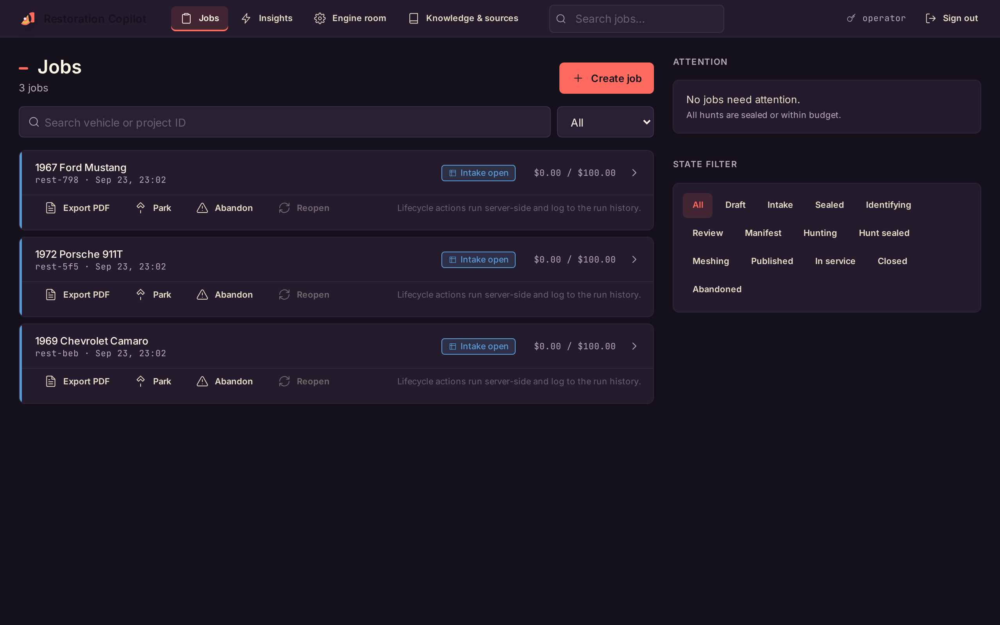

<div align="center">


**A copilot for small vintage-car restoration shops.**

Photos and a parts list go in. Out comes a structured, budget-enforced restoration job: identification, manifest, budget ruling, a parts hunt across your sources, and step-by-step guides on the mechanic's phone.




</div>

---

**The specification:** [`docs/specification/`](docs/specification/) holds the specification Sneferu built this from, copied word for word from its run record.

## The shop it's built for

Picture a one-person shop with eighteen jobs in flight, three marketplace tabs open, and a brake booster just lost to a faster bidder because nothing said the hunt was already over. When a number on screen is wrong (a budget ceiling, a coverage percentage, an API cost), the shop pays for it in real dollars and real hours.

Restoration Copilot runs every job through an explicit state machine and enforces the money rules. There's a parts budget and a separate API-cost ceiling, and every override is audited. Each job keeps a SQLite audit trail. Over time the shop builds up a learning ledger of identification corrections, vendor picks and purchase outcomes that makes the next job faster. **The operator keeps all the authority:** the system discovers, tracks and proves; the human decides, negotiates and buys.

Two people, two surfaces:

- **Operator console** (`/restoration-ui`): the owner runs intake, settles reviews, rules budgets, hunts parts, and manages guide tokens and providers.
- **Bay Guide** (`/guide/{token}`): the mechanic opens a revocable, expiring link on a phone. No account needed.

## Run it in two minutes

Needs Linux or macOS (POSIX `fcntl`) and Python 3.9+. Node 18+ only if you want to work on the frontend.

```bash
pip install -e .                      # add ".[dev]" for the e2e/audio tooling
python3 scripts/seed_restoration_kb.py
python3 scripts/validate_kb_seed.py   # → KB validation passed: 205 entries across 10 categories
python3 -m orchestrator.api.server    # stdlib WSGI on http://0.0.0.0:8000, no other services
```

Open **http://localhost:8000/restoration-ui** and sign in with the dev credentials `operator` / `restoration-dev`. Override them with `OPERATOR_USERNAME` / `OPERATOR_PASSWORD`.

Or drive it from a terminal:

```bash
curl http://localhost:8000/restoration/health
# {"module_loaded": true, "os_supported": true, ...}

curl -X POST http://localhost:8000/admin/operator/session \
  -H 'Content-Type: application/json' \
  -d '{"username": "operator", "password": "restoration-dev"}'
# {"session_token": "...", "username": "operator"}

curl -X POST http://localhost:8000/restoration/projects \
  -H 'Authorization: Bearer <session_token>' -H 'Content-Type: application/json' \
  -d '{"vehicle_meta": {"year": "1969", "make": "Chevrolet", "model": "Camaro"}}'
# 201 {"project_id": "rest-…", "run_id": "…"}
```

### See the whole journey in one script

```bash
python3 docs/examples/02_full_journey.py
```

It boots the app in-process and walks a job from start to finish: create → intake → seal → identify → lock manifest → budget ruling → audited override → hunt → partial-acceptance seal → negotiation + purchase → guide token → the guide page on a phone. It finishes with `JOURNEY PASS — every step matched the documented contract.` No keys, and no state left behind.

## What works today

- **Lifecycle state machine** (`draft → … → closed`, plus `abandoned` and `parked`) with guarded transitions and audit events
- **Photo intake** with magic-byte validation (JPEG/PNG/HEIC/WebP, ≤25 MB, ≤50 per batch), byte-identical storage, and CSV/TSV/free-text parts lists
- **Identification** from the parts list against a knowledge base, with a review queue that feeds the learning ledger
- **Manifest lock and budget ruling**: `AFFORDABLE` / `TIGHT` / `SHORTFALL_CRITICAL` / `INSUFFICIENT_DATA`, with an audited override
- **The sourcing hunt**: a tiered research primitive (source registry → LLM fallback through the host's bridge → `unstructured_lead`; standalone, the LLM tier has no bridge and is skipped), per-part budget allocation, coverage metrics, pause/resume, timeout, partial-acceptance seal, manual candidates, and negotiation and purchase tracking
- **Guide tokens**: mint, revoke, supersede, extend and bulk operations
- **API-cost ceiling**: warn at 80%, block at 100%, override on the record
- **Operations**: KB and source-registry CRUD; provider pause, resume, failover and recheck; boot-time crash reconciliation; stale-lock cleanup
- **React operator console and Bay Guide**, built and served by the backend

### Designed, not served yet

Several routes exist in the spec but not in this backend yet: vision-based identification from photos, 3D mesh generation and QA, guide publishing and bundles, PDF export, Shop Insights, and an HTTPS dev launcher. The console already has those screens behind capability gates, and they show honest placeholders while the backend reports them unavailable. [docs/API.md](docs/API.md#spec-routes-not-yet-implemented) has the exact list.

## Tests

```bash
python3 -m pytest tests/restoration/ -q               # 158 passed in ~4 s, no API keys
cd orchestrator/ui/app && npm ci && npm test           # 9 passed (vitest)
```

One health test compares the reported version with `git rev-parse HEAD`, so run the suite from a git checkout.

## Documentation

| | |
|---|---|
| [docs/ARCHITECTURE.md](docs/ARCHITECTURE.md) | how it fits together: C4, sequence, state and ER diagrams |
| [docs/API.md](docs/API.md) | every REST route, the auth model, the error catalog, curl examples |
| [docs/UI.md](docs/UI.md) | the operator console and Bay Guide screens, flows and design system |
| [docs/OPERATIONS.md](docs/OPERATIONS.md) | install, configure, run, monitor, back up, troubleshoot |
| [docs/examples/](docs/examples/README.md) | runnable scripts that exercise the product for real |
| [SOUL.md](SOUL.md) · [DESIGN.md](DESIGN.md) · [BRAND_IDENTITY.md](BRAND_IDENTITY.md) | who it's for, and how it should look and feel |

## Repository map

| Path | What it is |
|---|---|
| `orchestrator/api/server.py` | HTTP layer: the full REST surface as a stdlib WSGI app (mounts onto a FastAPI host in production) |
| `orchestrator/core/restoration_pipeline.py` | framework-agnostic core: state machine, intake, tasks, budget, sourcing, tokens, KB, ledger |
| `orchestrator/core/restoration_models.py` | Pydantic v2 data model |
| `orchestrator/core/research_primitives.py` | the tiered sourcing primitive, hermetically testable |
| `orchestrator/core/restoration_reconcile.py` | boot-time crash reconciliation and event-log divergence repair |
| `orchestrator/config/defaults.yaml` | the `restoration:` configuration block (thresholds, ceilings, ledger constants) |
| `orchestrator/prompts/packs/` | KB (YAML + 205-row seed CSV), source registry, glossary, pipeline pack |
| `orchestrator/ui/app/` | React + Vite + Tailwind source (operator console + Bay Guide) |
| `orchestrator/ui/web/` | the committed build, served by the backend |
| `tests/restoration/` | the backend suite (in-process WSGI client; `--e2e` for real providers) |

The `orchestrator/` layout is deliberate: it mirrors Sneferu's own, so the modules can mount into a Sneferu host.

## Built on Sneferu

The brief said the shop owner would have a Sneferu system running as the back end, so Restoration Copilot was built as a **Sneferu module** rather than a client of Sneferu's API:

- **The routes are meant to mount into Sneferu's own server.** `orchestrator/api/server.py` notes that its routes "mount into the claudopus FastAPI host" in production. Here they're served by a small stdlib WSGI app with the same routes and status codes.
- **Standalone shims.** The module leans on four Sneferu host routes: `POST/GET /admin/operator/session`, `GET /live/status`, `GET /bridge/health` and `POST /runs/start`. Standalone, it serves minimal stand-ins for them. `/runs/start` accepts only the `restoration_pipeline` workflow and returns a manual run id.
- **Model work goes through the host's bridge.** The sourcing hunt's LLM tier calls an injected bridge dispatcher. Standalone there isn't one, so the hunt uses the source registry and manual entries only. Vision identification from photos is designed but not served yet.

**Checked against a real Sneferu engine (2026-09-23).** All four host routes exist in Sneferu's route table, checked on a server built from its own source (checkout `07174496`). **Not yet done:** mounting the module into a Sneferu host. `restoration_pipeline` also isn't a registered Sneferu workflow, and Sneferu's `/runs/start` refuses unknown workflow names, so it would need registering there, for example as a generated workflow.

## How it was made

This product came out of **Sneferu's business pipeline**, from a brief for a small auto-restoration shop: photos and parts lists in, a sourced and budgeted restoration plan out, guides a mechanic can follow. Sneferu grounded the brief, wrote the product contract, and built it in cooperative rounds between independent coder and reviewer models (pipeline run `2026-08-01T17-33-31Z-pipeline-9f3d40e7`).

Three fixes landed before publishing. The operator console's sign-in now reads the backend's documented `session_token` field; the console's own contract test had caught the mismatch, and the committed bundle was rebuilt from source. And a declared dependency that doesn't exist on PyPI (`draco3d`, for a spec-future GLB compression step) was removed, so `pip install -e .` resolves on a clean machine. And the standalone `/bridge/health` stand-in no longer reports vision and sourcing bridges as configured and healthy when there's no bridge behind them.

<div align="center">

---

**Built by [Sneferu](https://sneferu.ai)**

<sub>README by Claude (Anthropic).</sub>

</div>
