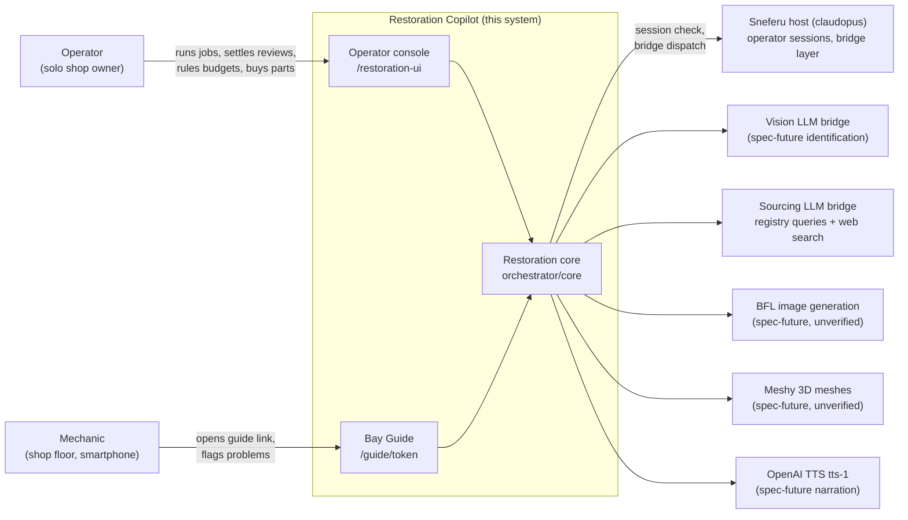
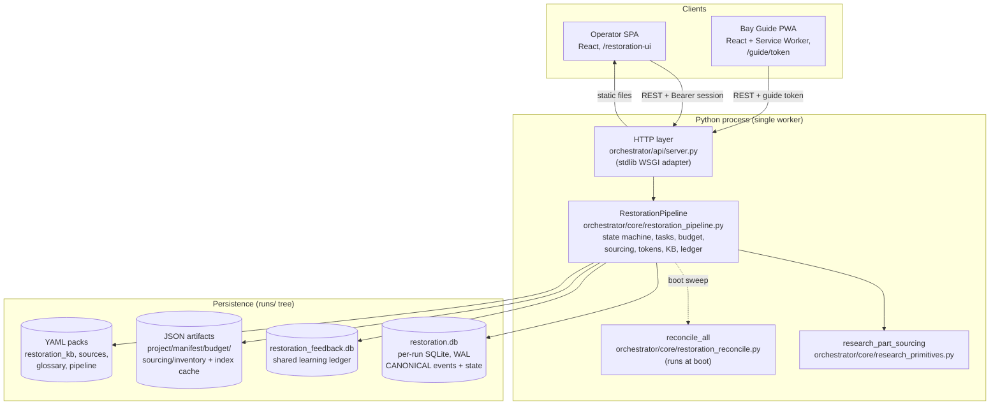
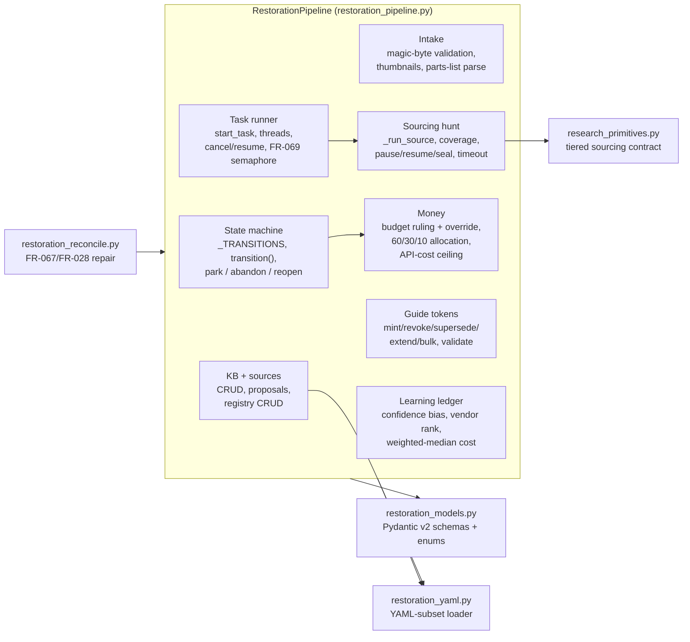
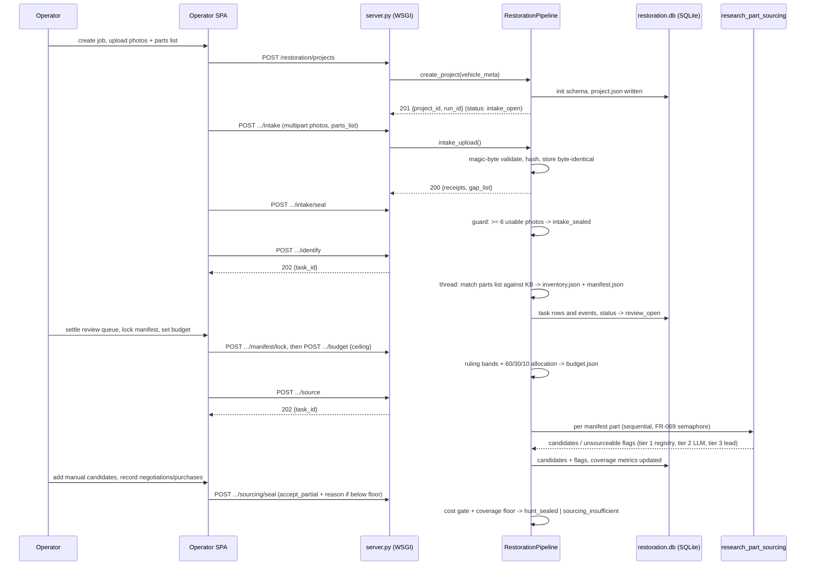
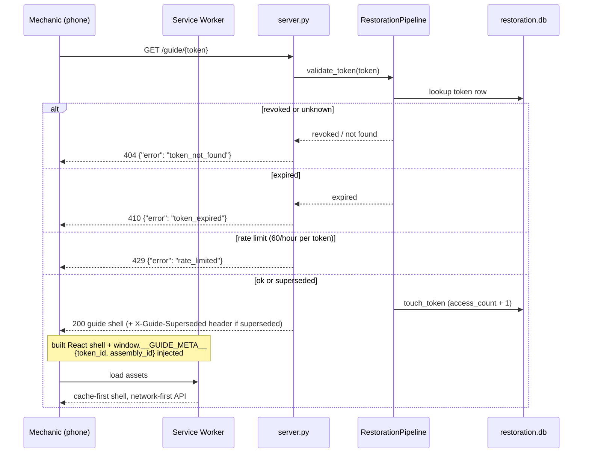
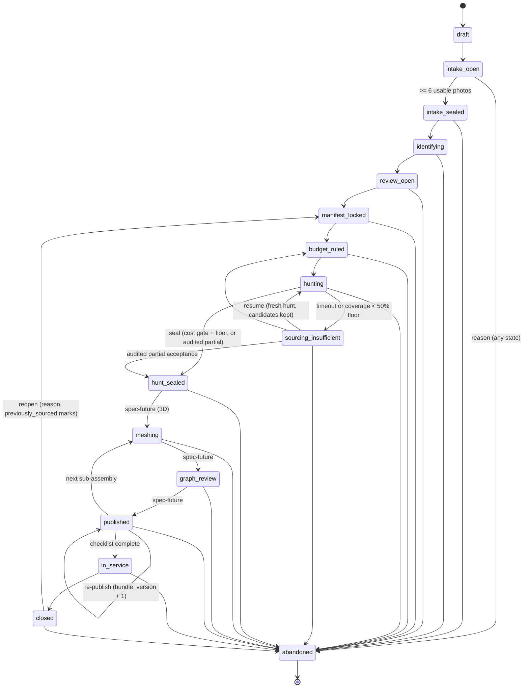
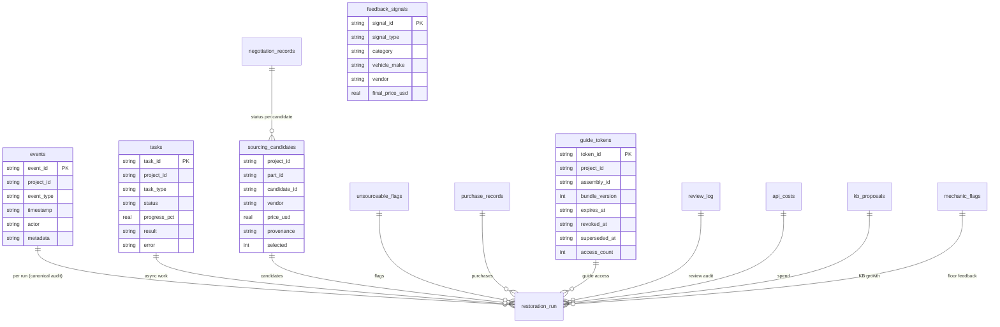

# Restoration Copilot — Architecture

This document describes the system **as it exists in this repository**. Where the frozen spec ([specification/SPECIFICATION.md](specification/SPECIFICATION.md)) designs behavior this backend does not serve yet, the section says so explicitly.

## Project shape

A hybrid: a Python backend module (library + HTTP service) with a two-surface TypeScript frontend and file/SQLite persistence. There is no separate application tier, message broker, or external database.

- **Backend:** `orchestrator/` — framework-agnostic core (`RestorationPipeline`) plus a thin stdlib-WSGI HTTP adapter (`orchestrator/api/server.py`). In production the same core mounts into the claudopus FastAPI host (see [Deployment model](#deploymentruntime-model)).
- **Frontend:** `orchestrator/ui/app/` — React 18 + Vite 5 + Tailwind 3 with two entry points (operator console, Bay Guide). The build is committed under `orchestrator/ui/web/static/restoration/app/` and served by the backend; legacy plain-HTML pages (`restoration_copilot.html`, `bay_guide.html`) are the fallback when no build exists.
- **Persistence:** per-run JSON artifacts + per-run SQLite (`restoration.db`, WAL), one shared cross-run learning-ledger DB, and YAML pack files (knowledge base, source registry, glossary).

## C4 Context — who and what the system touches



The five external provider integrations are the module's entire dependency surface beyond the host (spec FR-026). Only the sourcing leg has a code path today, and in this standalone build its dispatcher reports `BridgeUnavailableError` honestly; vision, BFL, Meshy, and TTS are spec-future.

## C4 Container — deployable units



Key container facts:

- **One process, threads for tasks.** Async work (identify, source) runs on daemon threads spawned by the pipeline (`_spawn`, `restoration_pipeline.py:1184`), gated by the FR-069 sourcing semaphore (3 global / 1 per project). `wsgiref` serves requests; there is no event loop in this build.
- **SQLite is canonical for transactional state.** JSON files are write-once artifacts and caches. `restoration_index.json` is a U1 cache rebuilt from SQLite + `project.json`; `events.jsonl` is a rotated secondary of the canonical SQLite `events` table (FR-028).
- **Boot self-healing.** `App.__init__` (`server.py:228`) runs `cleanup_stale_locks` (FR-068, dead-PID lock removal) and `reconcile_all` (FR-067) before serving; failure logs a warning and never blocks startup.

## Component view — inside the core



Responsibility split:

| Module | Owns |
|---|---|
| `restoration_pipeline.py` (3180 lines) | All state rules, persistence, task machinery, hunt orchestration, money rules, tokens, KB/sources/providers, ledger formulas. The single class the HTTP layer adapts. |
| `restoration_models.py` | §5 data model as Pydantic v2 models + enums (status spine, provenance, negotiation transitions, part taxonomy). |
| `research_primitives.py` | The FR-012 sourcing contract: template interpolation, tier order, dedup, retries, output validation. Bridge dispatch is **injected**, so it is hermetically testable. |
| `restoration_reconcile.py` | FR-067 boot reconciliation and FR-028 event-log divergence repair. Never raises. |
| `restoration_yaml.py` | Minimal YAML subset (block maps/sequences, JSON flow collections) used when PyYAML is absent; pack files stay PyYAML-loadable. |
| `api/server.py` | Routing, sessions, rate limiting, multipart parsing, static serving, error envelope. Zero business logic. |

## Primary flow — a job from intake to sealed hunt



After `hunt_sealed` the spec journey continues into 3D generation (`meshing`), assembly review, publish, and the mechanic guide. Those stages are spec-future in this build; token minting and the guide page shell already work (see [API.md — guide tokens](API.md#guide-tokens-fr-039fr-040fr-041)).

## Secondary flow — mechanic opens a guide link



The guide bundle endpoint (`/guide/{token}/bundle`) the React app polls is spec-future; today the shell loads and reports the bundle as unavailable rather than fabricating steps (see [UI.md — Bay Guide](UI.md#bay-guide-u6)).

## State machine — the project spine

The transition table is `_TRANSITIONS` in `restoration_pipeline.py:747`. `abandoned` is reachable from any state with a mandatory reason (all pending tasks cancelled); `parked` is an orthogonal flag that blocks all transitions except abandon.



Guard highlights: seal requires ≥6 usable photos (409 `insufficient_photos`); `in_service` requires the full configured checklist (400 `incomplete_checklist`); reopen requires a reason and marks previously sourced parts; an invalid transition returns 409 naming the current state and valid next states.

## Data and persistence

### Run-directory layout (verified live)

```text
runs/<run_id>/restoration/
├── project.json               # RestorationProject (+ .lock sidecar)
├── intake/
│   ├── photos/                # originals, byte-identical, sha256-prefixed names
│   ├── thumbnails/            # JPEG thumbs (skipped_no_pillow when stack absent)
│   ├── parts_list.csv         # uploaded list as received
│   └── parts_list.parsed.json # parsed rows
├── inventory.json             # ComponentRecord[] from identification
├── manifest.json              # entries + version + automation_coverage_pct
├── budget.json                # ruling + allocation + override_audit
├── sourcing.json              # summary snapshot (rebuilt from SQLite on drift)
├── events.jsonl               # rotated (10 MB x 5), secondary to SQLite events
├── guides/ qa_receipts/ flags/ artifacts/   # stage dirs (Phase 4+ use)
└── restoration.db             # per-run SQLite (WAL, 5 s busy timeout)

runs/restoration_feedback.db   # shared learning ledger (WAL)
runs/restoration_index.json    # U1 job-board CACHE (rebuilt from SQLite + project.json)
runs/.restoration_index.lock   # single-writer index lock (FR-048)
```

### Entity map — SQLite tables



`feedback_signals` lives in the shared `runs/restoration_feedback.db`; all other tables are per-run in `restoration.db`. Schemas are created additively on first access (`ensure_schema`), so there are no migrations.

### The money rules (pinned formulas)

- **Budget ruling** (`compute_budget_ruling`, `restoration_pipeline.py:2365`): unknown costs > 30% of parts → `INSUFFICIENT_DATA`; else total ≤ 80% of ceiling → `AFFORDABLE`; ≤ 100% → `TIGHT`; above → `SHORTFALL_CRITICAL`. Null costs are excluded from the sum, never zeroed.
- **Per-part allocation** (FR-010): critical 60% / standard 30% / optional 10% of the pool, per part `(tier_pct × ceiling) / tier_count`; empty tiers redistribute proportionally.
- **Coverage** (FR-013): `system_coverage` counts candidates with provenance `source_registry` or `research_primitive`; `total_coverage` adds `manual_entry`; an unsourceable flag with a fabrication GLB counts in both; critical-path applies the system formula to `critical` parts. Below the 50% system floor, a completed hunt transitions to `sourcing_insufficient`; sealing below floor requires `accept_partial` + reason (audited, FR-037).
- **API-cost ceiling** (FR-065, separate from the parts budget): warn at 80%, block new API-incurring tasks at 100%, operator override with reason.

### The learning ledger (FR-066)

Pure Python + SQL, no ML model:

- `adjusted_confidence = base + K × (agreement_rate − 0.5)`, K = 0.2, only when ≥ 5 weighted correction samples exist for the same category + make/model/year; recency weight `0.95^months_old`; corrections older than 12 months excluded; clamped to [0, 1]; every adjustment carries a `biasing_context` audit object.
- Vendor ranking: Σ recency weights of selections + 0.1 if selected in the last 30 days.
- Cost estimate: recency-weighted median of historical purchase prices (≥ 3 records, else the KB midpoint).

## Key design decisions

1. **Framework-agnostic core, thin HTTP adapter.** All rules live in `RestorationPipeline`; `server.py` only translates HTTP. Mounting onto the production FastAPI host is a mechanical re-adapter, not a rewrite (`pyproject.toml` declares the production dependency set).
2. **Stdlib WSGI in this build.** The sandbox/host constraint is documented in `IMPLEMENTATION_NOTES.md` (deliberate deviations): no FastAPI/uvicorn dependency, threads instead of asyncio, `cgi` multipart parsing (deprecated in 3.13 — replace on the FastAPI mount), Python ≥ 3.9 syntax.
3. **Hybrid JSON + SQLite with SQLite canonical.** Readable, diffable artifacts for the solo operator; transactional safety where concurrency exists; a boot-time reconciler repairs drift in both directions (FR-028/FR-067) and logs every correction.
4. **Magic-byte intake validation.** Content, never extension (FR-002): JPEG `FF D8 FF`, PNG `89 50 4E 47`, HEIC `ftypheic/ftypheix`, WebP `RIFF…WEBP`. Rejections are per-file with reasons; originals are preserved byte-identically.
5. **Honest degradation over fabricated success.** No Pillow → `thumbnail_status: skipped_no_pillow`. No bridge → hunt completes with `no_vendor_response` flags and coverage 0% → `sourcing_insufficient`, not a fake candidate list. Missing backend capabilities surface as gated UI placeholders, not hidden 404s.
6. **Tiered sourcing, serial order.** Registry templates first (RFC 3986 interpolation, null-OEM token removal), LLM fallback only when < 3 registry candidates, `unstructured_lead` for parse failures; dedup `part_id + vendor + oem_number + price ±5%` pairwise; 30 s timeout, 3 retries at 2/4/8 s; per-source rate-limit sleep.
7. **Hallucination defenses.** Part names cross-checked against the 10-category taxonomy (unknown category → review regardless of confidence); primitive output schema-validated (`manual_entry` rejected — manual candidates arrive only via REST); invalid prices become null.
8. **Tokens as the only mechanic credential.** 32-byte URL-safe tokens, 30-day expiry (extendable to 365), revocation/supersession, 60 req/hour/token rate limit, `Referrer-Policy: no-referrer`, `noindex`. The guide contains no personal data.

## Deployment/runtime model

- **This repository, standalone:** `python3 -m orchestrator.api.server` → `wsgiref` on `0.0.0.0:$PORT` (default 8000). Single process, single worker, daemon task threads. POSIX only (`fcntl.flock`; `os_supported` is checked and reported by `/restoration/health`).
- **Production (spec §8):** the same modules mount in-process into the claudopus FastAPI host (`uvicorn`), launched by the host's `launch.sh`; the host provides the operator session, `/live/status`, `/bridge/health`, `/runs/start`, and the bridge dispatchers. This repository carries minimal shims for those five endpoints so the product runs and tests standalone (FR-026).
- **Frontend:** served as committed static build from `orchestrator/ui/web/static/restoration/app/`; rebuild with `npm run build` in `orchestrator/ui/app` (a `postbuild` script fails the build if the frozen brand mark or entry pages are missing).
- **HTTPS:** required on the shop floor for Service Worker registration and wake-lock (FR-063). `scripts/generate_test_cert.py` mints a localhost self-signed pair for development; production needs a trusted cert via reverse proxy. The standalone WSGI entry does not terminate TLS.
- **Backup:** filesystem copy of `runs/` (WAL files included). Restore = copy back + restart; boot reconciliation verifies and repairs.

See [OPERATIONS.md](OPERATIONS.md) for the concrete commands.
